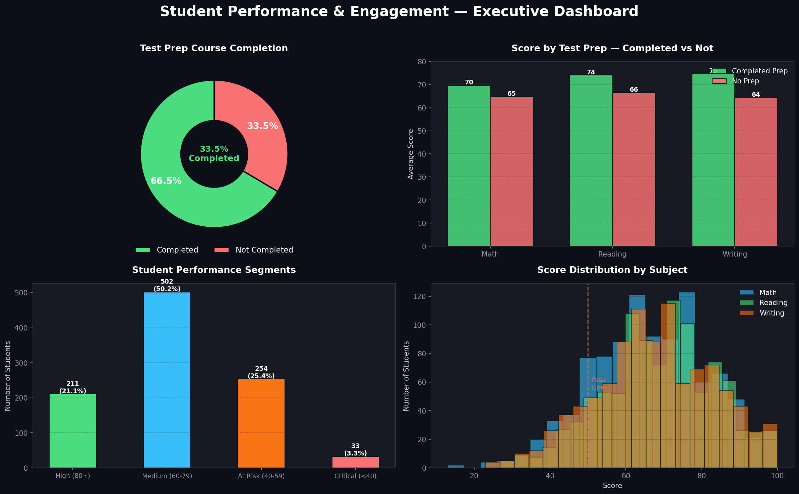
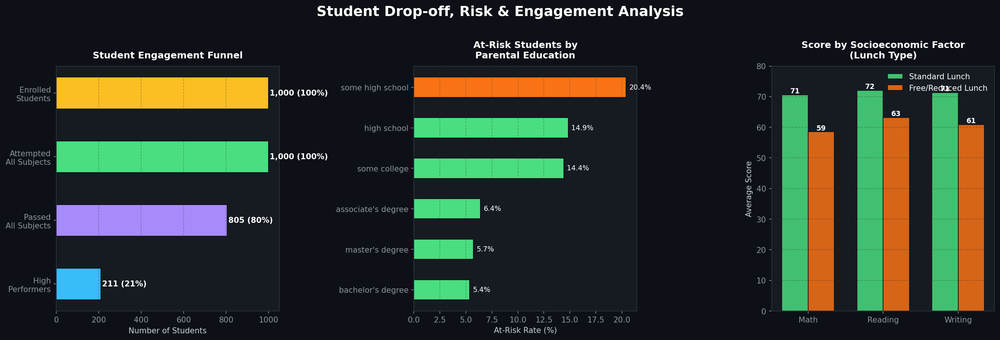

# 📚 Student Performance & Engagement Analysis
**Tools:** Python (Pandas, Matplotlib, Seaborn) · SQL  
**Dataset:** Students Performance in Exams — 1,000 students  
**Author:** Keerthi RK | Data Analyst

---

## 🎯 Project Overview
Analyzed student engagement and performance data to identify at-risk students, measure the impact of test preparation, and uncover key drop-off patterns. This project mirrors real-world EdTech / test prep analytics — the kind of work done to improve student outcomes and course completion rates.

---

## 🔍 Key Findings

| Insight | Finding |
|---|---|
| Test Prep Completion Rate | Only **33.5%** of students completed prep courses |
| Impact of Test Prep | Students with prep scored **+7.7 points higher** on average |
| Pass Rate (All Subjects) | **80.5%** passed all three subjects |
| At-Risk Students | **12.4%** of students scoring below 50 average |
| High Performers | **21.1%** of students scoring 80+ average |

---

## 📈 Dashboards

### Executive Dashboard


### Drop-off & Engagement Analysis


---

## 💡 Business Recommendations

1. **Boost test prep completion** — only 1 in 3 students complete prep; targeted nudges and reminders could significantly improve outcomes
2. **Early intervention for at-risk students** — 124 students scoring below 50 need personalized support before they drop off
3. **Parental education correlates with performance** — students from lower education backgrounds need additional support programs
4. **Test prep ROI is clear** — +7.7 point improvement justifies investing in making prep courses more accessible and engaging

---

## 📁 Project Structure

```
├── exams.csv                              # Raw dataset
├── student_analysis.py                    # Full Python analysis
├── student_analysis.sql                   # SQL queries
├── dashboard_1_student_executive.png      # Executive dashboard
├── dashboard_2_dropoff.png                # Engagement analysis
└── README.md
```

---

## 🛠️ How to Run

```bash
# Install dependencies
pip install pandas numpy matplotlib seaborn

# Run analysis
python student_analysis.py
```

---

## 📬 Connect
**LinkedIn:** linkedin.com/in/keerthi-r-81bb82200  
**Email:** keerthirk.work@gmail.com
